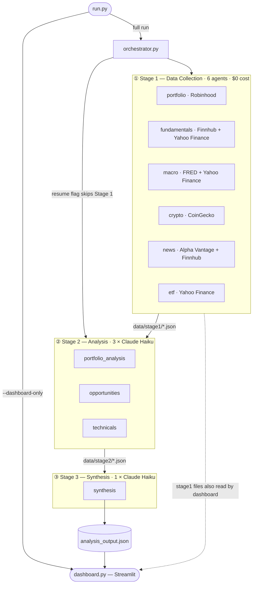

# Architecture

The pipeline runs in three sequential stages. Stage 1 collects live market data from six external APIs using direct Python calls — no AI, zero cost. Stage 2 feeds that data into three Claude Haiku calls that produce structured analysis files. Stage 3 merges everything into a single `analysis_output.json` final report, which the Streamlit dashboard reads.

---

## Data flow

| File | Written by | Read by |
|---|---|---|
| `data/stage1/portfolio.json` | stage1_portfolio | stage2_portfolio_analysis, stage2_technicals, stage3_synthesis, dashboard |
| `data/stage1/fundamentals.json` | stage1_fundamentals | stage2_portfolio_analysis, dashboard |
| `data/stage1/macro.json` | stage1_macro | stage2_portfolio_analysis, stage2_opportunities, stage3_synthesis |
| `data/stage1/crypto.json` | stage1_crypto | stage2_opportunities |
| `data/stage1/news.json` | stage1_news | stage2_portfolio_analysis, stage2_opportunities |
| `data/stage1/etf.json` | stage1_etf | stage2_opportunities |
| `data/stage2/portfolio_analysis.json` | stage2_portfolio_analysis | stage3_synthesis, dashboard |
| `data/stage2/opportunities.json` | stage2_opportunities | stage3_synthesis |
| `data/stage2/technicals.json` | stage2_technicals | stage3_synthesis, dashboard |
| `analysis_output.json` | stage3_synthesis | dashboard |

---

## mcp_server.py — 13 `_get_*` functions

| Function | External API | Used by |
|---|---|---|
| `_get_portfolio()` | Robinhood | stage1_portfolio |
| `_get_stock_fundamentals(ticker)` | Finnhub + Yahoo Finance | stage1_fundamentals |
| `_get_analyst_targets(ticker)` | Finnhub premium | unused — 403 on free tier |
| `_get_insider_trades(ticker)` | Finnhub premium | unused — 403 on free tier |
| `_get_institutional_holdings(ticker)` | Finnhub premium | unused — 403 on free tier |
| `_get_macro_data()` | FRED + Yahoo Finance | stage1_macro |
| `_get_sector_performance()` | Yahoo Finance | stage1_macro |
| `_get_crypto_data(coin_id)` | CoinGecko | stage1_crypto |
| `_get_crypto_trending()` | CoinGecko | stage1_crypto |
| `_get_news_and_sentiment(ticker)` | Alpha Vantage + Finnhub | stage1_news |
| `_get_etf_info(ticker)` | Yahoo Finance | stage1_etf |
| `_get_technical_indicators(ticker)` | Yahoo Finance | stage2_technicals |
| `_get_price_history(ticker)` | Yahoo Finance | unused — implemented but not called |
